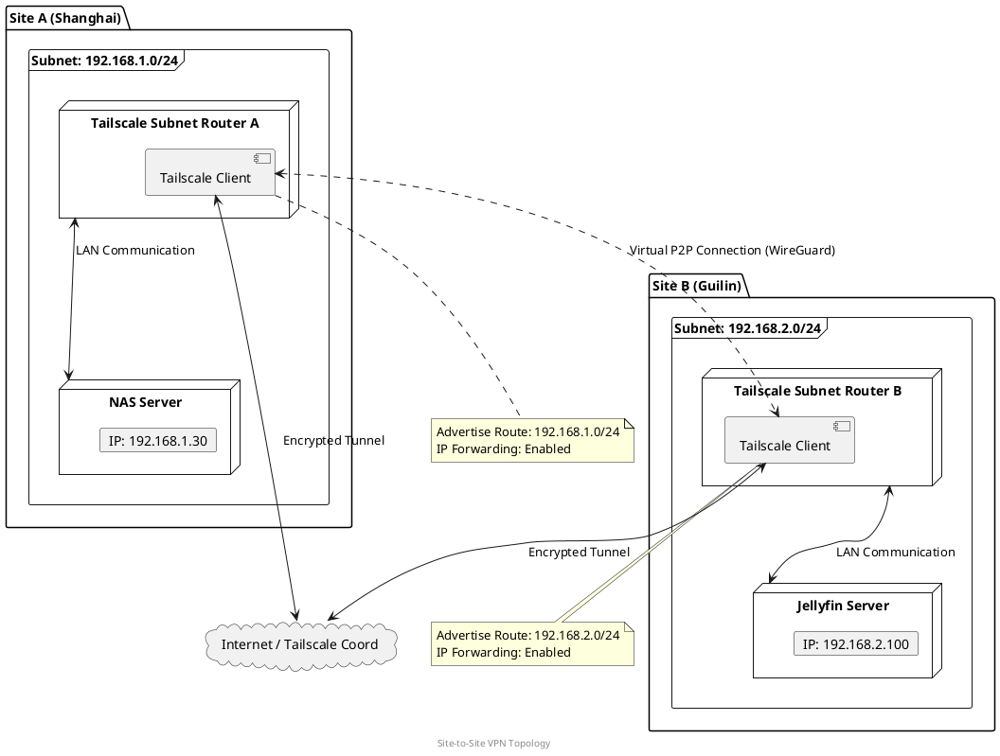

# 前言

Tailscale 是一个基于 WireGuard 的零配置 VPN 解决方案，能够轻松地在不同网络环境下实现设备间的安全连接。本文将介绍如何使用 Tailscale 实现 Site-to-Site VPN，连接两个不同的网络，使得它们之间的设备可以像在同一局域网内一样进行通信。

详情 请参考官方文档：[Tailscale Subnet Router](https://tailscale.com/kb/1019/subnets)

这个技术在家庭网络中非常方便，可以实现远程访问、资源共享等功能。

比如说你有两个家，一个在上海，一个在桂林，你可以通过 Tailscale 实现两个家庭网络
的互联，方便访问各自的设备和服务。

配置好子网和路由表转发后，两个网络内的设备就可以直接通过 IP 进行通信，不需要切换网络IP，就像在同一个局域网内一样。

比如 jellyfin IP是 `192.168.2.100`, 另一个网络内的设备可以直接通过 `192.168.2.100` 访问 jellyfin 服务。不需要多余的端口映射和域名解析，就可以丝滑使用。从上海回到桂林，不用做任何改动，直接访问在上海的设备。


# 网络拓扑图如下：





# 准备工作

在开始之前，确保你已经完成以下准备工作：

1. 注册并登录 Tailscale 账号。

2. 在两个不同的网络环境（A, B）中各有一台设备（如服务器、路由器等）作为 Tailscale 的节点。

3. 在这两台设备上安装并配置好 Tailscale 客户端。
   
   ```bash
   # 安装 Tailscale
   curl -fsSL https://tailscale.com/install.sh | sh
   # 启动 Tailscale 并登录
   sudo tailscale up
   ```

# 配置 Site-to-Site VPN


## 配置A网络

先配置 A网络的节点：
假设在这个网络中是有NAS服务器，IP地址是 `192.168.1.30`，网段是 `192.168.1.0/24`


1. **启用子网路由**：在每个节点上启用子网路由功能，使得该节点可以作为子网的路由器。
   
   ```bash
   sudo tailscale up --advertise-routes=<子网CIDR>
   ```
   
   例如，如果你的服务器是在A住所的网段是 `192.168.1.0/24`，你可以这样配置：
   
   ```bash
   sudo tailscale up --advertise-routes=192.168.1.0/24
   ```

2. **接受路由广播**：在 Tailscale 管理控制台中，接受来自两个节点的路由。注意这步骤需要在 Tailscale 的 Web 控制台中操作。

选择 "Subnet routes" 来允许节点之间的路由通信。然后点击 `Save ` 保存配置。


3. **配置防火墙规则**：确保两个网络的防火墙允许 Tailscale 的流量通过，特别是 WireGuard 使用的 UDP 端口（默认是 51820）。
4. **启用 IP 转发**：确保节点设备启用了 IP 转发功能，以允许数据包在不同子网之间转发。

   在 Linux 系统上，可以通过以下命令启用 IP 转发：

   ```bash
echo 'net.ipv4.ip_forward = 1' | sudo tee -a /etc/sysctl.d/99-tailscale.conf
echo 'net.ipv6.conf.all.forwarding = 1' | sudo tee -a /etc/sysctl.d/99-tailscale.conf
sudo sysctl -p /etc/sysctl.d/99-tailscale.conf
    ```

5. **配置路由表**：确保你的设备路由表中包含了正确的路由信息，以便将流量正确地引导到 Tailscale 网络。

在路由器上添加静态路由，将目标子网指向 Tailscale 节点的 IP 地址。如下图，作用是让局域网内的设备访问 `192.168.2.0/24` 网段的设备时，通过 Tailscale 节点进行转发。


### 配置B网络

接下来配置 B网络的节点：
这边的局域网内最有一个Linux 稳定运行设备，用于流量转发。

1. **安装 Tailscale 并登录**：

   ```bash
   curl -fsSL https://tailscale.com/install.sh | sh
   sudo tailscale up
   ```
2. **启用子网路由**，和上面相同。如果你不需要在 A网络内访问 B网络的设备，可以不配置子网路由。

   ```bash
   sudo tailscale up --advertise-routes=192.168.2.0/24
   ```

3.**启用 IP 转发**，和上面相同。用于转发流量到 A网络。

4. **配置路由表**：
在路由器上添加静态路由，将目标子网指向 Tailscale 节点的 IP 地址。如下图，作用是让局域网内的设备访问 `192.168.1.0/24` 网段的设备时，通过 Tailscale 节点进行转发。


# 测试连接
完成上述配置后，可以通过以下步骤测试 Site-to-Site VPN 的连接：
1. **Ping 测试**：从 A网络内的设备 ping B网络内的设备，反之亦然，确保能够互相通信。

   ```bash
   ping <B网络设备IP>
   ping <A网络设备IP>
   ```
2. **访问服务**：尝试从 A网络访问 B网络内的服务（如 Web 服务器、文件共享等），确保服务能够正常访问。


# 最后

原理可以参考 Tailscale 官方文档：[Tailscale Subnet Router](https://tailscale.com/kb/1019/subnets)
官方视频

<iframe width="560" height="315" src="https://www.youtube.com/embed/UmVMaymH1-s?si=bdBtooJkBjMztUqR" title="YouTube video player" frameborder="0" allow="accelerometer; autoplay; clipboard-write; encrypted-media; gyroscope; picture-in-picture; web-share" referrerpolicy="strict-origin-when-cross-origin" allowfullscreen></iframe>